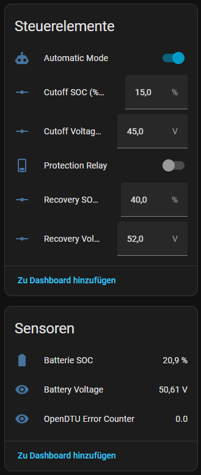
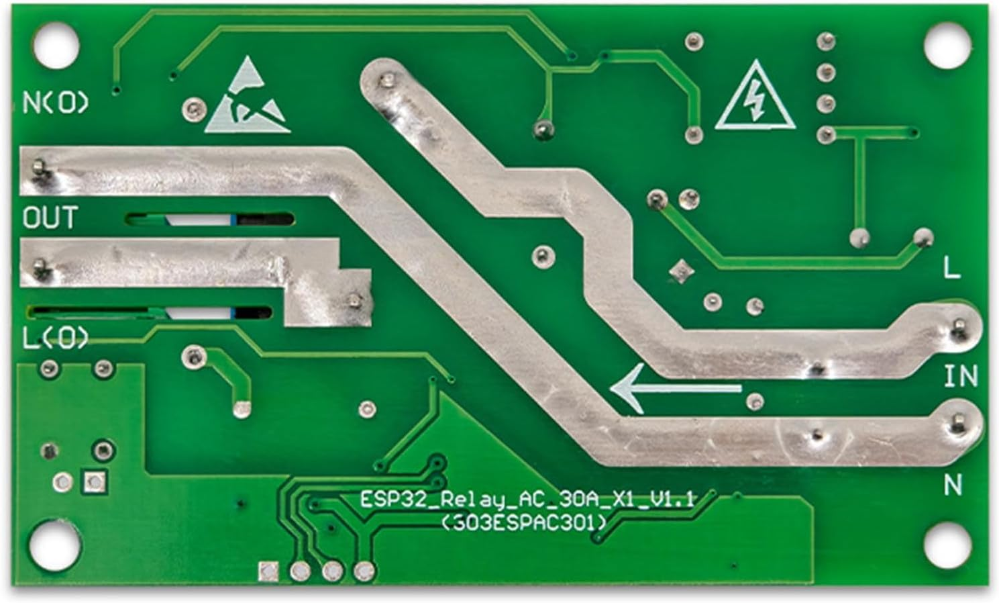

# PV Battery Guard Relay

An ESP32 Relay AC 30A is used in ESPHome to disconnect the AC power from the inverter depending on the required conditions.

The easiest way is to import the content of the YAML script in [ESPHome Builder](https://esphome.io/guides/getting_started_hassio/).
And add all required **SECRET** values to the `secrets.yaml`.

Finally, you can add a device to the ESPHome integration that provides the following possibilities:


## Prerequisites

### ESP32 AC Relay AC 30A X1 V1.1

The codes has been written for the following module:



### To build Targen on Host

Python wih `esphome` installed globally:

```shell
pip install esphome
```

## Check configuration and run build

```shell
esphome config ./pv-battery-guard.yaml
```

```shell
esphome run ./pv-battery-guard.yaml
```
