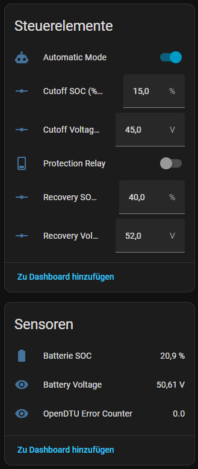
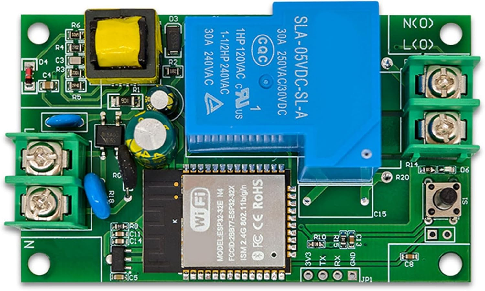
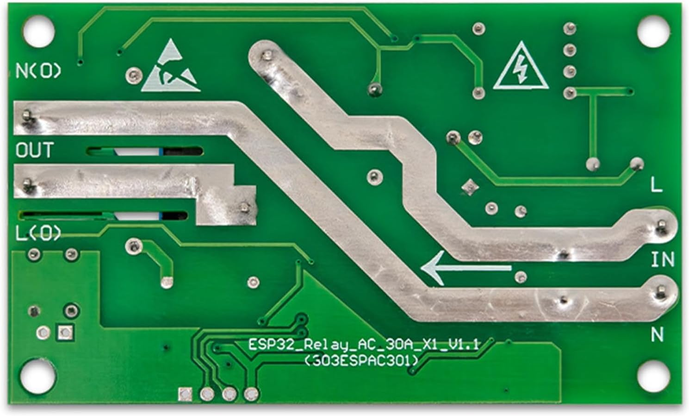

# PV Battery Guard Relay

An ESP32 Relay AC 30A is used in ESPHome to disconnect the AC power from the inverter depending on the required conditions.

The easiest way is to import the content of the YAML script in [ESPHome Builder](https://esphome.io/guides/getting_started_hassio/).
And add all required **SECRET** values to the `secrets.yaml`.

Finally, you can add a device to the ESPHome integration that provides the following possibilities:


## Prerequisites

- Successfully compile with [Python](https://www.python.org/downloads/) 3.11
- In case you build the firmware using this environment, create a **`secrets.yaml`** file in the root folder and add the following entries, customising them to fit your home environment:

  ```yaml
  # Your private Wi-Fi SSID and password
  wifi_ssid: "MySSID"
  wifi_password: "MyPassword"
  # Your privat Variables
  battery_guard_ha_api_key: "The Home Assistant API key is provided by the ESPHome Builder"
  battery_guard_ota_password: "The OTA password may be provided by the ESPHome builder"
  battery_guard_ap_password: "The AP password may be provided by the ESPHome builder"
  battery_guard_static_ip: 192.168.0.10
  battery_guard_gateway: 192.168.0.1
  battery_guard_subnet: 255.255.255.0
  ```

### ESP32 AC Relay AC 30A X1 V1.1

The codes has been written for the following module:



## Use poetry to install required packages

1. Install [poetry](https://python-poetry.org/docs/#installing-with-the-official-installer)
1. make sure you are using python 3.11: `poetry env use "D:\devtools\Python\Python311\python.exe"`
1. install required environment: `poetry install`
1. build the project: `poetry run esphome compile ./pv-battery-guard.yaml`

To compile and directly flash or upload the firmware to the target use:

```shell
poetry run esphome run ./pv-battery-guard.yaml
```

The following gif shows the build process:


## Recreating Poetry environment

Remove all environments: `poetry env remove --all`

Reinstall from Poetry's cache: `poetry install`
